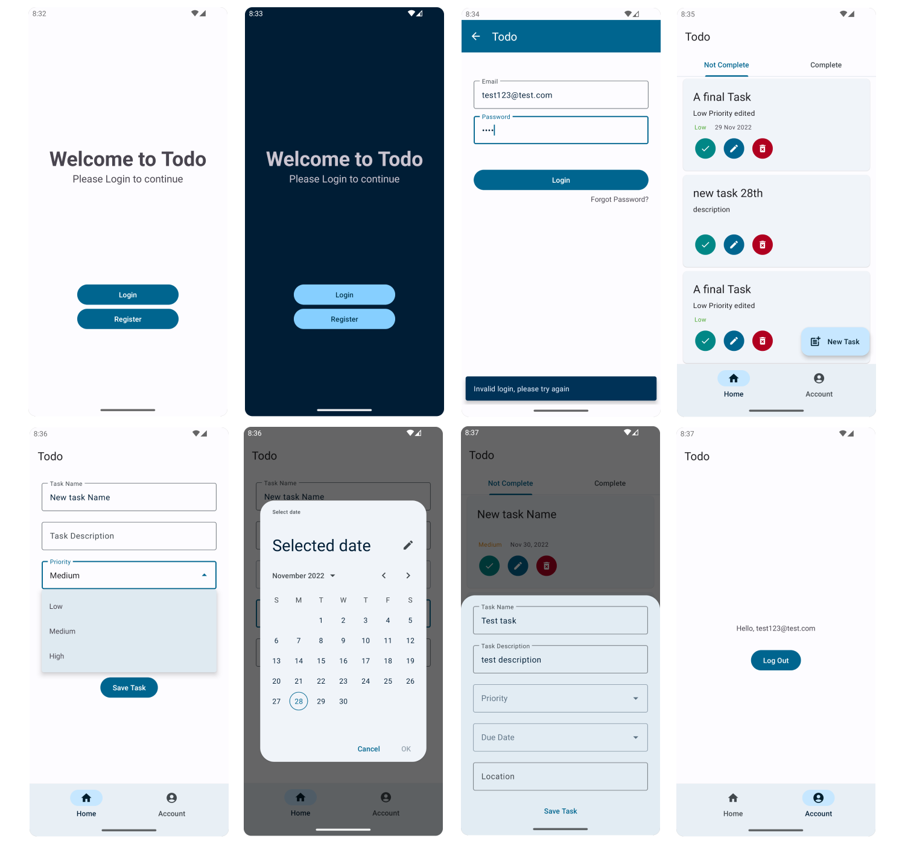

# DoneIt

DoneIt – A Task Management App for Your Productivity

## Details

DoneIt is your ultimate productivity partner, designed exclusively for Android users who want to take control of their tasks and goals. Built with the latest tech and a sleek interface, DoneIt combines efficiency and elegance to help you stay on top of your busy schedule.

DoneIt is a sleek and efficient task management app for Android, built using Kotlin, MVVM/Clean Architecture, and Firebase for seamless and secure functionality. With a modern Material 3 design, it adapts to light or dark mode based on your system preferences.

Whether it’s daily errands or big goals, DoneIt makes organizing tasks simple, so you can focus on what matters most. Get things done effortlessly with DoneIt! 

## Screenshots

## References

[Android Architecture Documentation](https://developer.android.com/topic/architecture)

[Firebase Documentation](https://firebase.google.com/docs/android/setup)

[Firebase with MVVM Playlist](https://www.youtube.com/playlist?list=PLIIWAqaTrNlg7q0cfajkBj8OwG60qpBVL)

[Material Design Components](https://m3.material.io/components)

[Material Design Theme Builder](https://m3.material.io/theme-builder)
